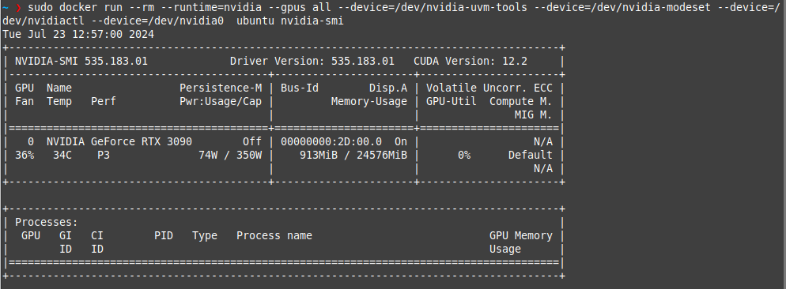

> First of all apologies for the rushed writing, but I'm too happy that I finally resolved my CUDA problem after days of trying. Maybe after I calm down a bit I'll come back to make it more pleasant to read.

I'm trying to run Nvidia Docker containers on my Linux Mint 21.3 machine. This solves the `Failed to initialize NVML: Unknown Error` problem. However, contrary to the other posts about `Failed to initialize NVML: Unknown Error`, where the GPU goes offline after a certain period of time, my GPU wasn't detected at all!

CUDA works great on bare metal, but once containerized there's always a problem of the GPU not being detected in Docker.

For my solution, check the last entry.


But first: neofetch
```
            ...-:::::-...                 user@computer
          .-MMMMMMMMMMMMMMM-.              ---------------- 
      .-MMMM`..-:::::::-..`MMMM-.          OS: Linux Mint 21.3 x86_64 
    .:MMMM.:MMMMMMMMMMMMMMM:.MMMM:.        Host: MS-7D51 1.0 
   -MMM-M---MMMMMMMMMMMMMMMMMMM.MMM-       Kernel: 5.15.0-113-generic 
 `:MMM:MM`  :MMMM:....::-...-MMMM:MMM:`    Uptime: 52 mins 
 :MMM:MMM`  :MM:`  ``    ``  `:MMM:MMM:    Packages: 3113 (dpkg) 
.MMM.MMMM`  :MM.  -MM.  .MM-  `MMMM.MMM.   Shell: zsh 5.8.1 
:MMM:MMMM`  :MM.  -MM-  .MM:  `MMMM-MMM:   Resolution: 2560x1440
:MMM:MMMM`  :MM.  -MM-  .MM:  `MMMM:MMM:   DE: Cinnamon 6.0.4 
:MMM:MMMM`  :MM.  -MM-  .MM:  `MMMM-MMM:   WM: Mutter (Muffin) 
.MMM.MMMM`  :MM:--:MM:--:MM:  `MMMM.MMM.   WM Theme: Mint-Y-Dark-Aqua (Mint-Y) 
 :MMM:MMM-  `-MMMMMMMMMMMM-`  -MMM-MMM:    Theme: Mint-Y-Aqua [GTK2/3] 
  :MMM:MMM:`                `:MMM:MMM:     Icons: Mint-Y-Sand [GTK2/3] 
   .MMM.MMMM:--------------:MMMM.MMM.      Terminal: gnome-terminal 
     '-MMMM.-MMMMMMMMMMMMMMM-.MMMM-'       CPU: AMD Ryzen 7 3700X (16) @ 3.600GHz 
       '.-MMMM``--:::::--``MMMM-.'         GPU: NVIDIA GeForce RTX 3090 
            '-MMMMMMMMMMMMM-'              Memory: 8751MiB / 32004MiB 
               ``-:::::-``
```

## My troubleshooting steps:

### Cgroupfs:
- this is probably not a problem anymore (fixed), but might as well do it because anything to do with CUDA is black magic
- Relevant Links:
  - https://github.com/NVIDIA/nvidia-docker/issues/1730#issue-1573551271
  - https://github.com/NVIDIA/nvidia-docker/issues/1671#issuecomment-1740502744
- tl;dr 

Set `/etc/docker/daemon.json` to 
```json
{
    "default-runtime": "nvidia",
    "runtimes": {
        "nvidia": {
            "args": [],
            "path": "nvidia-container-runtime"
        }
    },
    "exec-opts": ["native.cgroupdriver=cgroupfs"]
}
```


### Passing in the devices, in docker compose
 - Relevant Links:
   - https://github.com/AbdBarho/stable-diffusion-webui-docker/issues/389#issuecomment-1571340508
- tl;dr

Add the following to your `docker-compose.yaml`, under a service:
```yaml
service: ServiceName
  # ...
  deploy:
    resources:
      reservations:
        devices:
            - driver: nvidia                
              capabilities: ["gpu", "compute", "utility"]
              # "gpu" may or may not be present depending on the video card
```

### Pass in the GPU using --gpus all
- When you run something in Docker, tack on `--gpus all`
```sh
sudo docker run --rm --runtime=nvidia --gpus all ubuntu nvidia-smi                                             

>> Failed to initialize NVML: Unknown Error
```
...drat


### Passing in Devices (my problem):
- My problem: 
  - For some reason, the symlinks for all the different devices aren't made 
  - Had to add all the `--device=/dev/nvidia-uvm-tools --device=/dev/nvidia-modeset --device=/dev/nvidiactl --device=/dev/nvidia0`, otherwise it wouldn't be detected
  - Next up is to try
```sh
sudo nvidia-ctk system create-dev-char-symlinks \
    --create-all
```

  - Test if you have this problem:
  - `sudo docker run --rm --runtime=nvidia --gpus all --device=/dev/nvidia-uvm-tools --device=/dev/nvidia-modeset --device=/dev/nvidiactl --device=/dev/nvidia0  ubuntu nvidia-smi`
  - 
  - It works~
  
- Relevant links:
  - https://github.com/NVIDIA/nvidia-docker/issues/1730#issue-1573551271 (used the repro steps here to finally figure out that the GPU was indeed getting detected)


